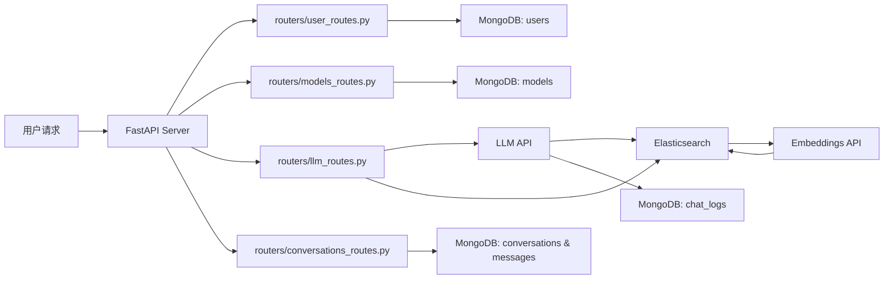

## 通过docker 启动 Elastic Search

- **Elasticsearch**
  - 启动命令:
    ```bash
    docker run -d --name elasticsearch -p 9200:9200 -e "discovery.type=single-node" -e "xpack.security.enabled=false" -e "ES_JAVA_OPTS=-Xms4g -Xmx4g" -e "xpack.security.enrollment.enabled=true" elasticsearch:8.17.2
    ```
  - 这样是开发模式，不需要认证，生产环境需要认证。
  - 请注意，Elasticsearch 8.17.2 是其中一个版本号，实际版本号可能有更新，不存在latest版本号。
  - 开源协议: 早期版本使用 Apache 2.0 许可，现版本采用 Elastic License 或 Server Side Public License（SSPL），具体许可请参考官方说明。
  - 商用说明: Elasticsearch 可用于商用，但需注意不同版本的许可限制。

已经创建好的Elastic search index :
如 index name 为 test_index
[http://localhost:9200/test_index](http://localhost:9200/test_index)


## 通过docker compose 启动 Elastic Search + Kibana

```bash
docker compose up -d
```


## 1. 创建索引

首先使用一个或多个 `dense_vector`字段创建索引。

```http
PUT /my-index
{
  "mappings": {
    "properties": {
      "vector": {
        "type": "dense_vector",
        "dims": 3
      },
      "text": {
        "type": "text"
      }
    }
  }
}
```


## 2. 采集您的数据

添加数据到 Elasticsearch。

```http
POST /my-index/_doc
{
  "vector": [1, 5, -20],
  "text": "hello world"
}
```


## 3. 执行向量搜索

现在您已准备就绪，可以通过搜索和集成来浏览数据。

```http
POST /my-index/_search
{
  "size" : 3,
  "query" : {
    "knn": {
      "field": "vector",
      "query_vector": [1, 5, -20]
    }
  }
}
```

Sample embeddings: 

